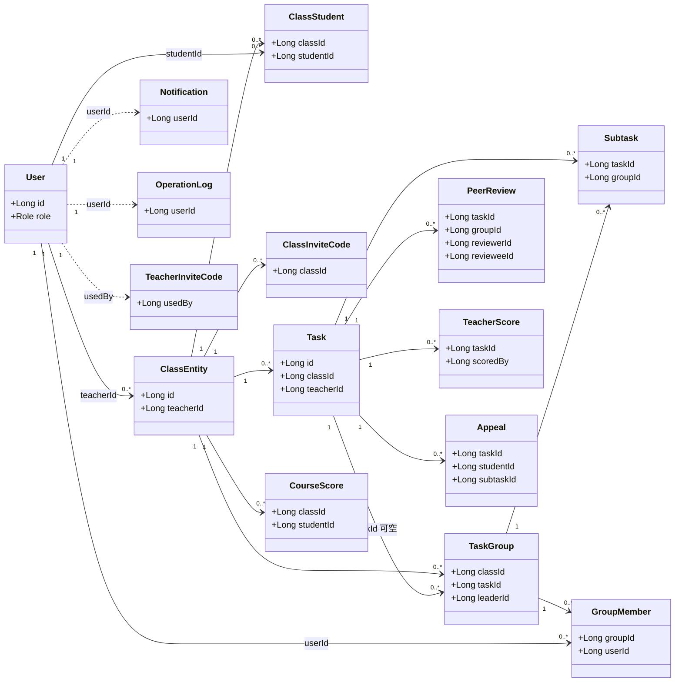
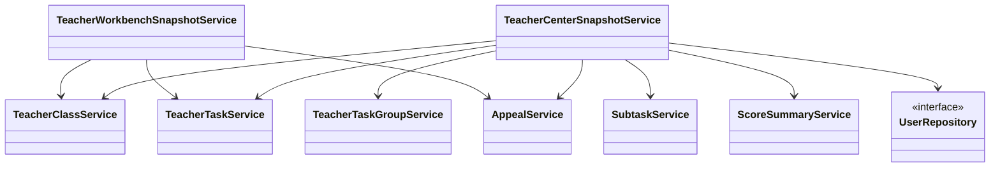
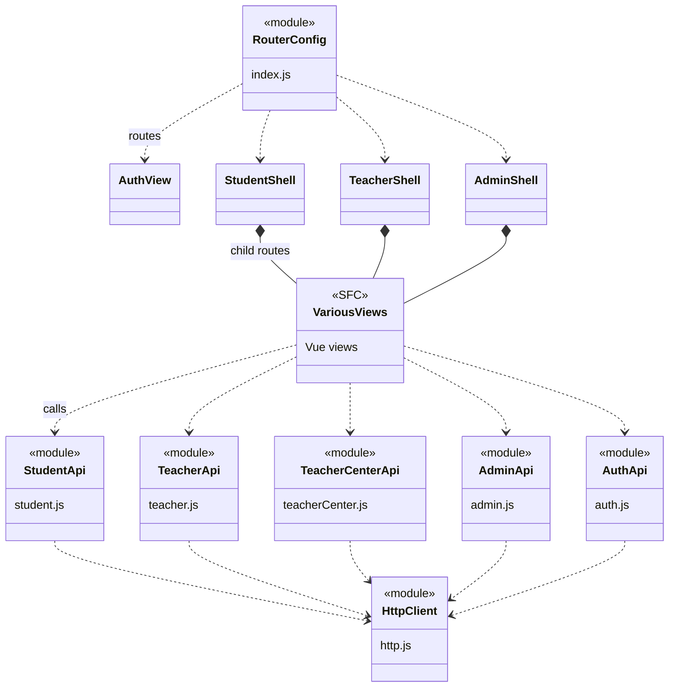

# TeamTrace 具体类图（UML / Mermaid）

本文档描述 **team-trace** 网站（Vue 3 前端 + Spring Boot 后端）的主要类及其依赖关系。实体层采用 **外键字段** 关联，未使用 JPA `@ManyToOne` 等关联注解；类图中的连线表示 **逻辑领域关系** 或 **Spring 构造注入依赖**。

**如何查看 / 导出**

- 在 **VS Code / Cursor** 中安装 “Markdown Preview Mermaid Support”，打开本文件预览。
- 或将各 ` ```mermaid ` 代码块粘贴到 [Mermaid Live Editor](https://mermaid.live) 导出 **SVG / PNG**。

---

## 1. 领域实体类图（逻辑外键关联）

> 多重性为业务语义示意；`TaskGroup.taskId` 可为空（学期固定组）。



---

## 2. 持久化仓储（接口）与实体

```mermaid
classDiagram
direction TB

class UserRepository <<interface>>
class ClassRepository <<interface>>
class ClassStudentRepository <<interface>>
class ClassInviteCodeRepository <<interface>>
class TaskRepository <<interface>>
class TaskGroupRepository <<interface>>
class GroupMemberRepository <<interface>>
class SubtaskRepository <<interface>>
class PeerReviewRepository <<interface>>
class TeacherScoreRepository <<interface>>
class CourseScoreRepository <<interface>>
class AppealRepository <<interface>>
class NotificationRepository <<interface>>
class OperationLogRepository <<interface>>
class TeacherInviteCodeRepository <<interface>>

class User
class ClassEntity
class ClassStudent
class ClassInviteCode
class Task
class TaskGroup
class GroupMember
class Subtask
class PeerReview
class TeacherScore
class CourseScore
class Appeal
class Notification
class OperationLog
class TeacherInviteCode

UserRepository ..> User : persists
ClassRepository ..> ClassEntity
ClassStudentRepository ..> ClassStudent
ClassInviteCodeRepository ..> ClassInviteCode
TaskRepository ..> Task
TaskGroupRepository ..> TaskGroup
GroupMemberRepository ..> GroupMember
SubtaskRepository ..> Subtask
PeerReviewRepository ..> PeerReview
TeacherScoreRepository ..> TeacherScore
CourseScoreRepository ..> CourseScore
AppealRepository ..> Appeal
NotificationRepository ..> Notification
OperationLogRepository ..> OperationLog
TeacherInviteCodeRepository ..> TeacherInviteCode
```

> Spring Data `JpaRepository` 以 `<<interface>>` 表示；仅画出与实体的对应关系。



---

## 3. REST 控制器 → 应用服务

> **说明**：除 `AuthController`、`TestController` 外，其余控制器均通过构造器注入 `JwtTokenProvider` 做身份解析；为减少视觉噪音，**本图不逐条绘制 JwtTokenProvider 依赖**，在实现类中一致存在。

```mermaid
classDiagram
direction TB

class AuthController
class TestController
class StudentProfileController
class StudentClassController
class StudentTaskController
class StudentSubtaskController
class StudentTaskGroupController
class StudentPeerReviewController
class StudentScoreSummaryController
class StudentAppealController
class StudentOperationLogController
class StudentAggregateController
class NotificationController
class TeacherClassController
class TeacherClassGroupController
class TeacherClassInviteCodeController
class TeacherTaskController
class TeacherSubtaskController
class TeacherPeerReviewController
class TeacherScoreSummaryController
class TeacherScoreController
class CourseScoreController
class TeacherAppealController
class TeacherDashboardController
class TeacherAnalyticsController
class TeacherProfileController
class TeacherOperationLogController
class AdminController
class AdminMonitorController
class AdminOperationLogController

class AuthService
class StudentProfileService
class StudentClassService
class StudentTaskService
class SubtaskService
class TeacherTaskGroupService
class StudentSemesterGroupService
class PeerReviewService
class ScoreSummaryService
class AppealService
class StudentOperationLogService
class NotificationService
class TeacherClassService
class TeacherClassInviteCodeService
class TeacherTaskService
class TeacherScoreService
class CourseScoreService
class DashboardService
class TeacherCenterSnapshotService
class TeacherWorkbenchSnapshotService
class TeacherProfileService
class TeacherOperationLogService
class AdminService
class AdminMonitorService
class AdminOperationLogService

AuthController --> AuthService

StudentProfileController --> StudentProfileService
StudentClassController --> StudentClassService
StudentTaskController --> StudentTaskService
StudentSubtaskController --> SubtaskService
StudentTaskGroupController --> TeacherTaskGroupService
StudentTaskGroupController --> StudentSemesterGroupService
StudentPeerReviewController --> PeerReviewService
StudentScoreSummaryController --> ScoreSummaryService
StudentAppealController --> AppealService
StudentOperationLogController --> StudentOperationLogService
StudentAggregateController --> StudentTaskService
StudentAggregateController --> AppealService
NotificationController --> NotificationService

TeacherClassController --> TeacherClassService
TeacherClassGroupController --> TeacherTaskGroupService
TeacherClassInviteCodeController --> TeacherClassInviteCodeService
TeacherTaskController --> TeacherTaskService
TeacherSubtaskController --> SubtaskService
TeacherPeerReviewController --> PeerReviewService
TeacherScoreSummaryController --> ScoreSummaryService
TeacherScoreController --> TeacherScoreService
CourseScoreController --> CourseScoreService
TeacherAppealController --> AppealService
TeacherDashboardController --> DashboardService
TeacherAnalyticsController --> TeacherCenterSnapshotService
TeacherAnalyticsController --> TeacherWorkbenchSnapshotService
TeacherProfileController --> TeacherProfileService
TeacherOperationLogController --> TeacherOperationLogService

AdminController --> AdminService
AdminMonitorController --> AdminMonitorService
AdminOperationLogController --> AdminOperationLogService
```



---

## 4. 应用服务 → 仓储与其它组件（核心域）

```mermaid
classDiagram
direction TB

class ClassMembershipService
class SemesterGroupAccess
class TaskSummaryMapper
class StudentTaskDetailViewResolver
class SnowflakeIdGenerator

class ClassRepository <<interface>>
class ClassStudentRepository <<interface>>
class ClassInviteCodeRepository <<interface>>
class TaskRepository <<interface>>
class TaskGroupRepository <<interface>>
class GroupMemberRepository <<interface>>
class SubtaskRepository <<interface>>
class PeerReviewRepository <<interface>>
class TeacherScoreRepository <<interface>>
class AppealRepository <<interface>>
class NotificationRepository <<interface>>
class UserRepository <<interface>>

class TeacherTaskService
class StudentTaskService
class SubtaskService
class TeacherTaskGroupService
class StudentSemesterGroupService
class StudentClassService
class PeerReviewService
class ScoreSummaryService
class AppealService
class NotificationService

TeacherTaskService --> ClassRepository
TeacherTaskService --> TaskRepository
TeacherTaskService --> SnowflakeIdGenerator
TeacherTaskService --> TaskSummaryMapper

StudentTaskService --> ClassRepository
StudentTaskService --> TaskRepository
StudentTaskService --> AppealRepository
StudentTaskService --> ClassMembershipService
StudentTaskService --> ClassStudentRepository
StudentTaskService --> TaskSummaryMapper
StudentTaskService --> StudentTaskDetailViewResolver

SubtaskService --> ClassRepository
SubtaskService --> TaskRepository
SubtaskService --> SemesterGroupAccess
SemesterGroupAccess --> TaskRepository
SemesterGroupAccess --> TaskGroupRepository
SubtaskService --> GroupMemberRepository
SubtaskService --> SubtaskRepository
SubtaskService --> ClassMembershipService
SubtaskService --> SnowflakeIdGenerator
SubtaskService --> NotificationService

TeacherTaskGroupService --> ClassRepository
TeacherTaskGroupService --> TaskGroupRepository
TeacherTaskGroupService --> GroupMemberRepository
TeacherTaskGroupService --> ClassMembershipService

StudentSemesterGroupService --> ClassRepository
StudentSemesterGroupService --> TaskGroupRepository
StudentSemesterGroupService --> GroupMemberRepository
StudentSemesterGroupService --> ClassMembershipService

StudentClassService --> ClassInviteCodeRepository
StudentClassService --> ClassStudentRepository
StudentClassService --> ClassRepository
StudentClassService --> ClassMembershipService
StudentClassService --> GroupMemberRepository
StudentClassService --> TaskGroupRepository
StudentClassService --> UserRepository

PeerReviewService --> ClassRepository
PeerReviewService --> TaskRepository
PeerReviewService --> SemesterGroupAccess
PeerReviewService --> GroupMemberRepository
PeerReviewService --> PeerReviewRepository
PeerReviewService --> ClassMembershipService

ScoreSummaryService --> ClassRepository
ScoreSummaryService --> TaskRepository
ScoreSummaryService --> SemesterGroupAccess
ScoreSummaryService --> GroupMemberRepository
ScoreSummaryService --> PeerReviewRepository
ScoreSummaryService --> TeacherScoreRepository
ScoreSummaryService --> ClassMembershipService

AppealService --> TaskRepository
AppealService --> ClassRepository
AppealService --> ClassMembershipService
AppealService --> AppealRepository
AppealService --> TeacherScoreRepository
AppealService --> NotificationService
AppealService --> SubtaskRepository
AppealService --> GroupMemberRepository
AppealService --> TaskGroupRepository

NotificationService --> NotificationRepository
```



---

## 5. 应用服务 → 仓储与其它组件（班级 / 成绩 / 面板 / 认证 / 管理）

```mermaid
classDiagram
direction TB

class PasswordEncoder <<interface>>
class JwtTokenProvider
class TokenBlacklistService
class SnowflakeIdGenerator

class UserRepository <<interface>>
class TeacherInviteCodeRepository <<interface>>
class ClassRepository <<interface>>
class ClassStudentRepository <<interface>>
class ClassInviteCodeRepository <<interface>>
class TaskRepository <<interface>>
class TaskGroupRepository <<interface>>
class GroupMemberRepository <<interface>>
class SubtaskRepository <<interface>>
class PeerReviewRepository <<interface>>
class TeacherScoreRepository <<interface>>
class AppealRepository <<interface>>
class CourseScoreRepository <<interface>>
class OperationLogRepository <<interface>>

class AuthService
class StudentProfileService
class TeacherProfileService
class TeacherClassService
class TeacherClassInviteCodeService
class TeacherScoreService
class CourseScoreService
class DashboardService
class TeacherOperationLogService
class StudentOperationLogService
class OperationLogService
class ClassMembershipService
class AdminService
class AdminMonitorService
class AdminOperationLogService

AuthService --> UserRepository
AuthService --> TeacherInviteCodeRepository
AuthService --> PasswordEncoder
AuthService --> SnowflakeIdGenerator
AuthService --> JwtTokenProvider
AuthService --> TokenBlacklistService

StudentProfileService --> UserRepository
StudentProfileService --> PasswordEncoder

TeacherProfileService --> UserRepository
TeacherProfileService --> PasswordEncoder

TeacherClassService --> ClassRepository
TeacherClassService --> ClassStudentRepository
TeacherClassService --> ClassInviteCodeRepository
TeacherClassService --> UserRepository
TeacherClassService --> TaskRepository
TeacherClassService --> TaskGroupRepository

TeacherClassInviteCodeService --> ClassRepository
TeacherClassInviteCodeService --> ClassInviteCodeRepository

TeacherScoreService --> TeacherScoreRepository
TeacherScoreService --> TaskRepository
TeacherScoreService --> ClassRepository
TeacherScoreService --> UserRepository

CourseScoreService --> ClassRepository
CourseScoreService --> ClassStudentRepository
CourseScoreService --> CourseScoreRepository
CourseScoreService --> UserRepository

DashboardService --> ClassRepository
DashboardService --> ClassStudentRepository
DashboardService --> TaskRepository
DashboardService --> TaskGroupRepository
DashboardService --> GroupMemberRepository
DashboardService --> SubtaskRepository
DashboardService --> PeerReviewRepository
DashboardService --> TeacherScoreRepository
DashboardService --> AppealRepository

TeacherOperationLogService --> OperationLogRepository
TeacherOperationLogService --> ClassRepository

StudentOperationLogService --> OperationLogRepository
StudentOperationLogService --> ClassMembershipService

OperationLogService --> OperationLogRepository

ClassMembershipService --> ClassStudentRepository

AdminService --> UserRepository
AdminService --> TeacherInviteCodeRepository
AdminService --> PasswordEncoder

AdminMonitorService --> ClassRepository
AdminMonitorService --> TaskRepository
AdminMonitorService --> TaskGroupRepository
AdminMonitorService --> ClassStudentRepository
AdminMonitorService --> UserRepository

AdminOperationLogService --> OperationLogRepository
```



---

## 6. 只读聚合快照服务



---

## 7. 前端分层（概念类图）

> Vue 单文件组件与 `services` 模块不构成 TypeScript/Java 类，此处按 **分层职责** 画出依赖方向。



---

## 8. 与源码路径对照

| 层次 | Java 包路径 |
|------|-------------|
| 实体 | `com.teamtrace.backend.entity` |
| 仓储 | `com.teamtrace.backend.repository` |
| 应用服务 | `com.teamtrace.backend.service` |
| 控制器 | `com.teamtrace.backend.controller` |
| 安全 | `com.teamtrace.backend.security` |
| 领域解析器 | `com.teamtrace.backend.domain.task`（如 `StudentTaskDetailViewResolver`） |
| 工具 | `com.teamtrace.backend.util`（如 `SnowflakeIdGenerator`） |

---

*图表依据 `team-trace-backend` 与 `team-trace-frontend` 当前源码构造器注入与实体字段整理；若后续重构依赖关系，请同步更新本文件。*
